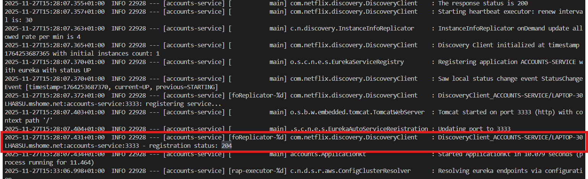
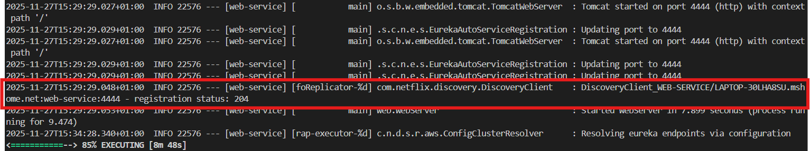
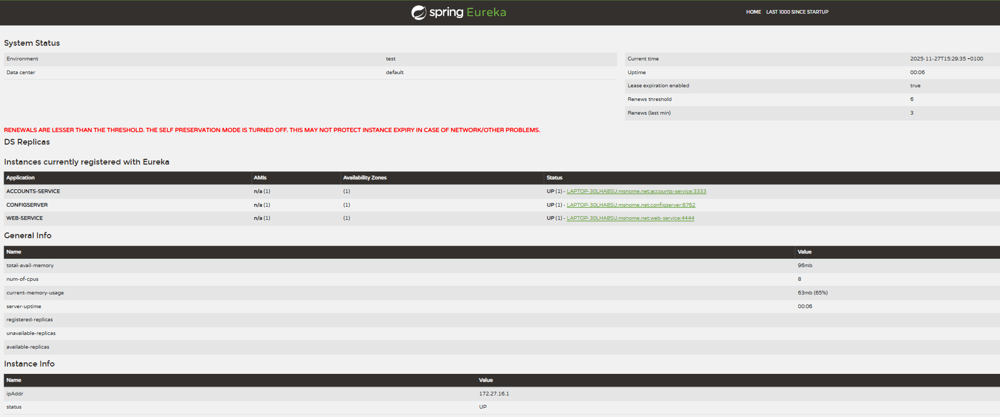
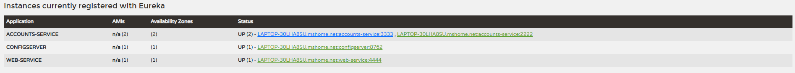
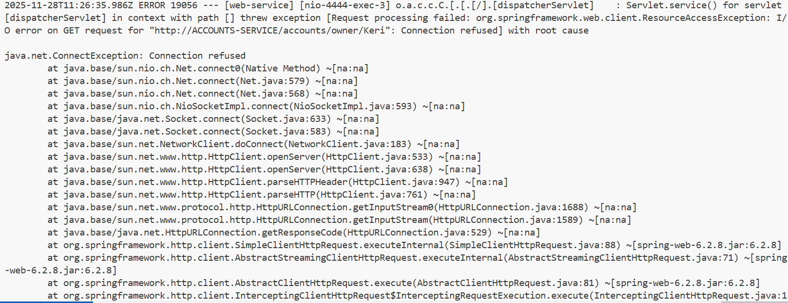
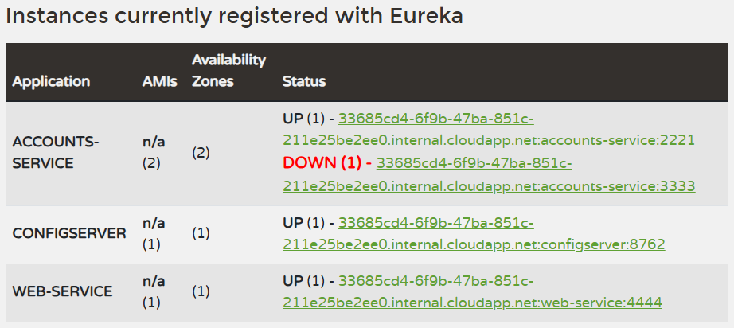
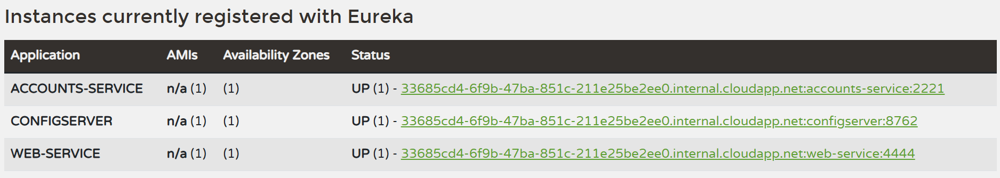

# Lab 6 Microservices - Project Report

## 1. Configuration Setup

**Configuration Repository**: https://github.com/LauraH379/lab6-microservices-LauraH379

The HTTP server port of the ACCOUNTS-SERVICE was modified. Specifically, this parameter was changed:
```
server:
  port: 2221
```
**Port 2221 was used instead of 2222 because, when performing the exercise in GitHub Codespaces, it indicated that this port was already in use**

This change makes the new instance of the Accounts service listen on port 2222 instead of 3333, without the need to modify the microservice’s source code.

**Why is externalized configuration useful in microservices?**

Externalized configuration is fundamental in microservice architectures because:

- It allows changing ports, URLs, credentials, or parameters without recompiling or redeploying the code.
- It makes it easier for each environment (development, test, production) to have its own configuration.
- It enables running multiple instances of the same service with different configurations (as in this practice).
- It centralizes configuration management in a single place (Config Server).
- It improves the scalability and maintainability of the system.

In this practice, thanks to externalized configuration, it was possible to launch a second instance of ACCOUNTS-SERVICE on another port simply by changing the .yml file, without touching the code.

---

## 2. Service Registration (Task 1)

### Accounts Service Registration



During the registration of the **ACCOUNTS-SERVICE**, the following occurs:

#### 1. Application Startup
- The service starts the application and loads the default profile.  
  **Log example:**  
  `Starting ApplicationKt using Java 21.0.2 ... (15:27:59.546)`

#### 2. Config Server Retrieval
- It queries the **Config Server** to obtain its external configuration (Spring Cloud Config).  
  **Relevant logs:**  
  - `Fetching config from server at : http://localhost:8762 (15:27:59.625)`  
  - `Located environment: name=accounts-service... (15:27:59.625)`  
- This indicates that the service retrieves **accounts-service.yml** from the configuration server.

#### 3. Web and Database Initialization
- It initializes the web layer (Tomcat) and the embedded database; prepares beans and repositories.  
  **Logs:**  
  - `Tomcat initialized with port 3333 (http) (15:28:02.466)`  
  - JPA initialization and messages about the database and repositories (`15:28:01.429 → 15:28:03.224`, etc.)

#### 4. Eureka Client Initialization
- It initializes the **Eureka client (DiscoveryClient)**: retrieves the registry from the Eureka server and starts the heartbeat mechanism.  
  **Examples:**  
  - `Getting all instance registry info from the eureka server`  
  - `The response status is 200 (15:28:07.355)`  
  - `Starting heartbeat executor: renew interval is: 30 (15:28:07.357)`

#### 5. Registration with Eureka
- It changes its local status to **UP** and registers with Eureka.  
- Finally, it sends the registration request to the Eureka server and receives an HTTP 204 response (registration accepted).  
  **Key logs:**  
  - `Registering application ACCOUNTS-SERVICE with eureka with status UP (15:28:07.370)`  
  - `DiscoveryClient_ACCOUNTS-SERVICE/...: registering service... (15:28:07.372)`  
  - `DiscoveryClient_ACCOUNTS-SERVICE/... - registration status: 204 (15:28:07.431)`

In conclusion, the service successfully obtained its configuration from the Config Server, started its web server and JPA, contacted the Eureka server to synchronize the instance registry, and completed its registration successfully (HTTP 204 response), making it available for other services to discover.

### Web Service Registration



When the DiscoveryClient starts, WEB-SERVICE obtains a copy of the Eureka registry (the list of registered applications/instances). When the application needs to call the accounts service, it uses a RestTemplate configured for resolution with the discovery client. This allows it to invoke ACCOUNTS-SERVICE without knowing its fixed URL; Eureka / Spring Cloud LoadBalancer resolve an available instance (host + port) and perform the call.

Evidence in logs:

- Discovery Client initialized ... with initial instances count: 2 (15:29:28.973) indicates that the registry contains 2 instances (probably Eureka + the accounts service already registered).

- The line The RestTemplate request factory is ... shows that RestTemplate is ready to make requests; combined with the use of DiscoveryClient, these requests are resolved to registered instances.

---

## 3. Eureka Dashboard (Task 2)



The Eureka dashboard shows the status of the discovery server and the list of instances that are currently registered. It provides environment information, timings (current time, uptime), basic metrics, and most importantly, a table with the registered applications and their instances (host/port and status).

**Which services are registered?**
- ACCOUNTS-SERVICE — appears registered and in state UP; the entry shows its host and port: LAPTOP-30LHA8SU.mshome.net:accounts-service:3333.

- CONFIGSERVER — configuration server (port 8762) appears registered and UP.

- WEB-SERVICE — frontend (port 4444) appears registered and UP.

**What information does Eureka track for each instance?**

For each registered instance, the dashboard displays (and/or allows querying) at least the following fields:

- Application name — e.g., ACCOUNTS-SERVICE.
- Status — e.g., UP (indicates the instance has renewed its lease and is considered alive).
- Instance ID / Host + context — identification including hostname and port, e.g., LAPTOP-30LHA8SU.mshome.net:accounts-service:3333.
- Port — the port on which the instance runs (e.g., 3333, 8762, 4444).
- Availability Zone / Data center — zone or data center reported (in the UI, shown in the Availability Zones column).
- AMIs / number of instances — count of replicas/AMIs (in the table it shows n/a (1) indicating 1 replica).
- Detailed instance information — IP (ipAddr), status, uptime (server-uptime), memory usage, number of CPUs, etc. (these fields appear further down in Instance Info / General Info).

**About the red warning**

This indicates that Eureka’s self-preservation mode is disabled and that the number of renewals received is below the expected threshold. In this lab (and on Windows), this is an intentional configuration (eureka.server.enable-self-preservation: false) so that Eureka quickly evicts dead instances during failure/recovery tests. It must be documented in the report because it affects how and when Eureka marks instances as down.

---

## 4. Multiple Instances (Task 4)




**What happens when you start a second instance of the accounts service?**

When a second instance of ACCOUNTS-SERVICE starts:
- The new instance is automatically registered in Eureka.
- Eureka then shows two instances of the same service.

Each instance has:
- A different host and port (for example: one on 3333 and another on 2222).
- Status UP if it is running correctly.

Both are available to receive requests from other services.
This demonstrates that the system is horizontally scalable.

**How does Eureka handle multiple instances?**

Eureka manages multiple instances of a service in the following way:
- It stores all registered instances under the same application name (ACCOUNTS-SERVICE).
- Each instance has its own:

    - instanceId
    - IP
    - Port
    - Status (UP / DOWN)

- Instances send periodic heartbeats to confirm they are still alive.
- If an instance stops responding, Eureka removes it from the registry.
- Clients can query Eureka and receive the complete list of available instances.

Therefore, Eureka does not choose which instance to use; it only keeps the catalog of active instances up to date.


**How does client-side load balancing work with multiple instances?**

Client-side load balancing works as follows:

1. WEB-SERVICE does not call a fixed IP or port.
2. Instead, it calls the service by its logical name: ACCOUNTS-SERVICE
3. The client (via Spring Cloud LoadBalancer):

    - Queries Eureka.
    - Receives the list of available instances (for example: 3333 and 2222).

4. Chooses one instance using a load-balancing algorithm (normally round-robin).
5. Sends the request to that selected instance.
6. On the next request, it may use the other instance.

Result:

- Requests are automatically distributed between both instances.
- If one fails, only the active one is used.
- The system continues to function without manual intervention.

## 5. Service Failure Analysis (Task 5)

### Initial Failure



Immediately after stopping the ACCOUNTS-SERVICE instance running on port 3333:

- The WEB-SERVICE attempts to process a request that requires data from the accounts service (for example, GET http://ACCOUNTS-SERVICE/accounts/owner/Keri).
- The WEB-SERVICE’s RestTemplate (wrapped by Spring Cloud LoadBalancer) selects an instance for the call. Due to the latency between the removal of the failed instance in Eureka and the client’s cache update, the WEB-SERVICE tries to connect to the already closed instance.
- The connection fails immediately with java.net.ConnectException: Connection refused, which triggers a ResourceAccessException in the Spring stack: the HTTP call cannot open a socket because no process is listening on that host:port.
- This exception interrupts the normal flow of the web controller, and Spring attempts to render the error page. While rendering the Thymeleaf error template, a second exception (TemplateProcessingException) occurs because the error template tries to include a fragment (header :: copy) that cannot be resolved in that context.

### Eureka Instance Removal



**How long did it take for Eureka to remove the dead instance?**

After stopping the ACCOUNTS-SERVICE instance on port 3333:

The instance first remains in Eureka as DOWN.

After a short interval of time, which is set in the variable eviction-interval-timer-in-ms in the application.yml file (1sec), Eureka checks if there are instances that have been removed, and then:

- Completely deletes the dead instance from the registry.
- Only the active instance on port 2221 remains visible.


**What mechanism does Eureka use to detect failures?**

Eureka detects failures through the heartbeat (lease renewal) mechanism.

- Each registered microservice periodically sends a heartbeat signal to the Eureka server.
- This signal confirms that the instance is still alive.
- If Eureka stops receiving heartbeats from an instance for the configured time:

  - It first marks the instance as DOWN.
  - And if the situation continues, it automatically removes the instance from the registry.

- Since in this practice the self-preservation mode is disabled:
```
eureka:
  server:
    enable-self-preservation: false
```
the removal is fast and aggressive, ideal for failure and recovery testing.

---

## 6. Service Recovery Analysis (Task 6)



**Why does the web service eventually recover?**

The WEB-SERVICE recovers because Eureka still has at least one active instance of the ACCOUNTS-SERVICE registered, in this case the one running on port 2221.

When the instance on port 3333 is stopped:

- Eureka marks it as DOWN and later removes it.
- The instance on port 2221 remains registered as UP.
- The WEB-SERVICE, when querying Eureka, obtains the updated list of available instances.

From that moment on, all requests are automatically redirected only to the live instance.

**How long did recovery take?**

The recovery time was very short, and it corresponds to the interval required for Eureka to:

- Detect the absence of heartbeats.
- Mark the failed instance as DOWN.
- Update its registry.
- The additional time until the WEB-SERVICE refreshes its local cache of the registry.

Once the cache is updated, the system recovers automatically and transparently for the user.

**What role does client-side caching play in the recovery process?**

The client cache plays a key role in the recovery process:

- The WEB-SERVICE keeps a local copy of the Eureka registry in memory.
- When an instance fails, Eureka takes a few seconds to update the registry.
- In the meantime, the client may continue trying to use the failed instance if it is still in its cache.
- Once:

  - Eureka updates the registry, and
  - The WEB-SERVICE refreshes its cache,

  then the failed instance disappears from the list and is no longer used.

---

## 7. Conclusions

**What I Learned**

Microservices Architecture: An application composed of small, independent services facilitates horizontal scaling, independent deployments, and the adoption of different technologies per service.

Service Discovery with Eureka: Eureka acts as a dynamic registry: instances register, periodically renew their lease, and can be discovered by logical name by other services. This eliminates the need for fixed URLs and enhances resilience.

Resilience and Self-Healing: By combining Eureka (registry/discovery), a Config Server (externalized configuration), and client-side load balancing, the application achieves fault tolerance: if one instance fails, traffic can be redirected to active replicas.

Importance of Error Handling: The experiment showed that although the infrastructure supports failover, the client code (WEB) must handle exceptions, retries, and degradations to provide a stable experience during the switchover window.

Value of Externalized Configuration: Changing ports or parameters without touching the code simplifies testing and deployments, and allows multiple instances to run with different settings.

**Challenges and How I Solved Them**

Latency in Registry/Client Cache Updates: When stopping an instance, Connection refused errors occurred because the client attempted to use an outdated entry. Solution: I documented the behavior, adjusted tests to use another active instance, and proposed introducing retries/fallbacks in the client.

Errors in the Error Template (Thymeleaf): The error page threw another exception when rendering the fragment header :: copy. Solution: I strengthened error handling in the report and suggested making templates more tolerant (conditional inclusions) and capturing relevant exceptions in the controller.

Ports Occupied in Codespaces: I chose 2221 instead of 2222 due to conflicts in the environment; this illustrates why externalized configuration is useful.

---

## 8. AI Disclosure

**Did you use AI tools?**

ChatGPT: It helped me draft and formulate the sections of the report. I wrote it in Spanish, and it helped me translate it into English and provide more technical explanations.

What I did personally: I carried out all the experiments and changes in the environment (starting/stopping services, modifying the accounts-service.yml file, checking the Eureka dashboard, and capturing logs and screenshots). I validated that the technical descriptions matched the actual logs; I selected and highlighted the most relevant log lines; I took the screenshots and manually verified the observed behavior (registration, failure, and recovery).

## Additional Notes

This laboratory highlighted the importance of combining infrastructural mechanisms (Eureka, Config Server, LoadBalancer) with good practices in client code to truly achieve resilience and availability of the application.

